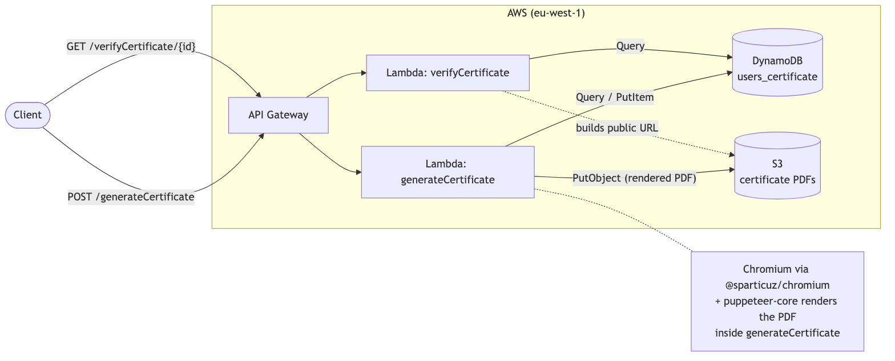
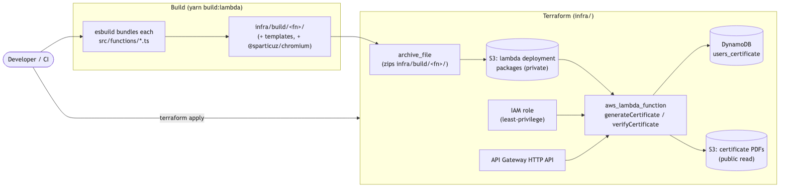

# 📜 Certificate Generation Service

[](https://github.com/luizcurti/nodejs-serverless/actions/workflows/ci.yml)
[](https://nodejs.org)
[](LICENSE)
[](https://www.typescriptlang.org/)

A service that generates and verifies PDF certificates, running on AWS Lambda, DynamoDB, and S3, deployed with Terraform.

## What it does

- **Generate a certificate** (`POST /generateCertificate`): validates the request, stores/reuses a `{id, name, grade}` record in DynamoDB, renders a Handlebars HTML template to a PDF with headless Chromium, and uploads the PDF to S3.
- **Verify a certificate** (`GET /verifyCertificate/{id}`): looks up the record by id and returns its public PDF URL, or `404` if it doesn't exist.

## Architecture



- **API Gateway** (HTTP API) routes the two HTTP endpoints to their Lambda functions.
- **generateCertificate** reads/writes `DynamoDB` and renders the PDF using [`@sparticuz/chromium`](https://github.com/Sparticuz/chromium) + `puppeteer-core` (a Lambda-compatible headless Chromium), then uploads it to `S3`.
- **verifyCertificate** only reads `DynamoDB` and builds the S3 URL from the id — it never touches S3 directly.

More diagrams (source in [`docs/mmd`](docs/mmd), rendered in [`docs/img`](docs/img)):

| Diagram | |
|---|---|
| [Generate certificate flow](docs/img/generate-certificate-flow.png) | Full request → DynamoDB → Chromium → S3 sequence |
| [Verify certificate flow](docs/img/verify-certificate-flow.png) | Lookup + found/not-found sequence |
| [Deployment architecture](docs/img/deployment-architecture.png) | How `yarn build:lambda` + Terraform turn source into running infrastructure |
| [Local dev stack](docs/img/docker-compose-local-dev.png) | How the Docker Compose services connect |

## Requirements

- Node.js 24.x
- Yarn (the project is developed and locked against Yarn 1 / `yarn.lock`)
- Docker and Docker Compose (for LocalStack-based local dev, integration tests, and Docker validation)
- [Terraform](https://developer.hashicorp.com/terraform) >= 1.6 and an AWS account (only needed to deploy)

## Installation

```bash
yarn install
```

## Environment variables

| Variable | Description | Default |
|---|---|---|
| `IS_OFFLINE` | Set to `true` to use LocalStack (local DynamoDB/S3 endpoints + test credentials) instead of real AWS | — |
| `AWS_REGION` | AWS region used by the SDK clients | `eu-west-1` |
| `S3_BUCKET_NAME` | S3 bucket for storing PDF certificates | `certificadoignite2021` |
| `DYNAMODB_ENDPOINT` | DynamoDB endpoint override (local dev) | `http://localhost:4566` |
| `S3_ENDPOINT` | S3 endpoint override (local dev) | `http://localhost:4566` |
| `PORT` | Port for the local dev server (`yarn dev`) | `3000` |

See [`.env.example`](.env.example) for a ready-to-copy local `.env`.

## Local development

No account or login of any kind is needed to run this locally — the dev server is a small, dependency-free `http` adapter (`scripts/local-server.ts`), not a hosted framework CLI.

1. **Start LocalStack** (DynamoDB + S3 emulation) and the DynamoDB admin UI:
   ```bash
   yarn docker:up
   ```
2. **Run the API locally**:
   ```bash
   IS_OFFLINE=true yarn dev
   ```
3. **Try it**:
   ```bash
   curl -X POST http://localhost:3000/generateCertificate \
     -H "Content-Type: application/json" \
     -d '{"id": "test123", "name": "John Doe", "grade": "A+"}'

   curl http://localhost:3000/verifyCertificate/test123
   ```
4. **DynamoDB Admin UI**: `http://localhost:8001`
5. **Stop LocalStack**: `yarn docker:down`

## Docker

`docker-compose.yml` defines three services on one network:

- `localstack` — DynamoDB + S3 (pinned to `4.0.3`; newer LocalStack images require a paid/free account token just to boot, even for these community services)
- `dynamodb-admin` — a UI for the LocalStack DynamoDB table, at `http://localhost:8001`
- `app` — this service, built from the repo's `Dockerfile`, running the same local dev server on port 3000

```bash
yarn docker:up                     # localstack + dynamodb-admin only
docker compose up -d --build app   # add the app container
docker compose logs -f
yarn docker:down
```

The `Dockerfile` uses `node:24-bookworm-slim` (Debian), not `node:24-alpine`: the Chromium binary bundled by `@sparticuz/chromium` is glibc-linked and cannot run on Alpine's musl libc. It also installs the small set of shared libraries (`libnss3`, `libatk-bridge2.0-0`, etc.) that headless Chromium needs at runtime.

The bundled Chromium binary is **x86_64-only** (matching this service's default AWS Lambda architecture). On an Apple Silicon / arm64 machine, build and run the `app` image with `--platform linux/amd64` (Docker will emulate it); GitHub Actions' `ubuntu-latest` runners are x86_64 natively, so CI needs no such flag.

## Testing

```bash
yarn test              # unit tests (mocked AWS SDK + Chromium, no external services)
yarn test:coverage     # unit tests with a coverage report
yarn test:integration  # real DynamoDB/S3/Chromium against LocalStack — run `yarn docker:up` first
yarn test:api          # Postman/Newman collection over real HTTP — run `yarn docker:up` first
```

- **Unit tests** (`tests/unit/`) mock DynamoDB, S3, Handlebars, and Chromium/Puppeteer, and cover both handlers' validation, happy-path, and failure branches.
- **Integration tests** (`tests/integration/`) call the handlers directly against a real LocalStack (DynamoDB + S3) and a real headless Chromium render — no mocks. This is also what CI runs against the Dockerized LocalStack.
- **API/collection tests** (`tests/api/`) exercise the same handlers over real HTTP, using the same local server as `yarn dev`, and a Postman collection (`tests/api/certificate.postman_collection.json`) run with [Newman](https://github.com/postmanlabs/newman). It covers a successful generate, missing-field and invalid-JSON validation errors, a successful verify, and a not-found verify.

Coverage report: `coverage/lcov-report/index.html` after `yarn test:coverage`.

## Code quality

```bash
yarn format:check   # Prettier
yarn format         # Prettier --write
yarn lint           # ESLint (src/, tests/, scripts/)
yarn lint:fix
npx tsc --noEmit    # typecheck
yarn build          # tsc build, used for typechecking/CI (the deployed bundle is produced separately, see Deployment)
```

## API reference

### `POST /generateCertificate`

```json
{ "id": "user-unique-id", "name": "John Doe", "grade": "A+" }
```

| Status | Body |
|---|---|
| `201 Created` | `{ "message": "Certificate created successfully", "url": "https://<bucket>.s3.amazonaws.com/<id>.pdf" }` |
| `400 Bad Request` | `{ "message": "Request body is required" }` / `"Invalid JSON in request body"` / `"id, name and grade are required"` |

If `id` already exists, the stored `name`/`grade` are reused (no duplicate DynamoDB write) so the regenerated PDF always matches the database record.

### `GET /verifyCertificate/{id}`

| Status | Body |
|---|---|
| `200 OK` | `{ "message": "Valid certificate", "name": "John Doe", "url": "https://<bucket>.s3.amazonaws.com/<id>.pdf" }` |
| `400 Bad Request` | `{ "message": "Certificate ID is required" }` |
| `404 Not Found` | `{ "message": "Certificate not found" }` |

## Deployment

Infrastructure lives in [`infra/`](infra) (Terraform, AWS provider). Lambda deployment packages are built separately with esbuild (`scripts/build-lambda.js`), since Terraform doesn't bundle application code itself.

```bash
aws configure                # AWS credentials
yarn build:lambda            # bundles both functions into infra/build/
terraform -chdir=infra init  # first time only (or after changing providers)
yarn infra:plan              # build + terraform plan
yarn infra:apply             # build + terraform apply
```

`terraform output` (or the `apply` output) prints the API's base URL, the DynamoDB table name, and the certificate bucket name. `yarn infra:destroy` tears everything down.

State is local by default (`infra/terraform.tfstate`, gitignored) — fine for a single developer or small team. For shared/team use, add an S3 backend block to `infra/versions.tf` (with its own small bootstrap: a state bucket + a DynamoDB lock table).

`var.certificate_bucket_name` (in `infra/variables.tf`) defaults to `certificadoignite2021`; S3 bucket names are globally unique across all AWS accounts, so you must override it (`terraform apply -var certificate_bucket_name=your-unique-name`).



## CI

`.github/workflows/ci.yml` runs on every push/PR to `main`: install → dependency audit (production dependencies) → format check → lint → typecheck → unit tests with coverage → build → Lambda packaging + `terraform validate` (no AWS credentials needed or used) → Docker build → LocalStack (Docker Compose) → integration tests → API/collection tests → full containerized app smoke test → teardown. CI never runs `terraform plan`/`apply` against a real account.

## Security

- **IAM least-privilege**: the Lambda execution role is scoped to specific DynamoDB actions (`GetItem`, `PutItem`, `Query`) on the `users_certificate` table only, and `PutObject`/`GetObject` on the certificate bucket only (see `infra/lambda.tf`).
- **Deployment artifacts are private**: Lambda zip packages are uploaded to a separate, private S3 bucket — never the public certificate bucket.
- **Input validation**: required fields (`id`, `name`, `grade`) are validated before processing; malformed JSON bodies are caught explicitly.
- **Resource cleanup**: the headless browser is always closed via `try/finally`.
- **Dependency audit**: `yarn audit --groups dependencies` runs in CI. As of this writing there is one accepted, unpatched finding: a symlink-traversal issue in `extract-zip`, pulled in transitively by `puppeteer-core`'s browser-download helper (`@puppeteer/browsers`). This codebase never calls that helper — it always launches Chromium via an explicit `executablePath` — so the vulnerable code path is unreachable at runtime.

## Project structure

```
├── src/
│   ├── functions/             # Lambda handlers
│   ├── templates/             # Handlebars certificate template + stamp image
│   └── utils/                 # DynamoDB document client
├── scripts/
│   ├── local-server.ts        # Plain HTTP adapter used by `yarn dev` and the API tests
│   ├── bundle-server.js       # esbuild helper shared by run-dev-server.js / run-api-tests.js
│   ├── run-dev-server.js      # `yarn dev`
│   ├── run-api-tests.js       # `yarn test:api`
│   └── build-lambda.js        # `yarn build:lambda` - packages functions for Terraform
├── tests/
│   ├── unit/                  # Mocked unit tests
│   ├── integration/           # Real LocalStack integration tests
│   └── api/                   # Postman/Newman collection
├── infra/                     # Terraform: Lambda, IAM, API Gateway, DynamoDB, S3
├── docs/
│   ├── mmd/                   # Mermaid diagram sources
│   └── img/                   # Rendered diagrams
├── localstack-init/init.sh    # Creates the DynamoDB table + S3 bucket on LocalStack boot
├── docker-compose.yml
├── Dockerfile
└── .github/workflows/ci.yml
```

## Architectural decisions

- **Terraform over Serverless Framework**: Serverless Framework v4 requires an interactive login / license key even for fully local runs (`serverless offline`) — a real friction point for local dev and CI. Terraform has no such requirement; local dev now runs on a plain, dependency-free HTTP adapter instead of a hosted framework CLI.
- **API Gateway HTTP API, not REST API**: simpler and cheaper in Terraform for a plain Lambda-proxy API with no custom authorizers. `payload_format_version = "1.0"` is used so Lambda still receives the classic event shape the handlers are already written against — no handler code changes were needed.
- **Two S3 buckets**: the certificate bucket is intentionally public-read (the API returns direct S3 URLs); Lambda deployment packages go to a separate, private bucket so application source code is never exposed by the same public-read policy.
- **Chromium stack**: migrated from the unmaintained `chrome-aws-lambda` (2021, bundled Chromium ~92, most of the project's known CVEs traced back to it) to `@sparticuz/chromium` + current `puppeteer-core`, pinned to versions matching Chromium 143 and Node ≥20.11 to stay compatible with the `nodejs24.x` Lambda runtime.
- **LocalStack pinned to `4.0.3`**: newer images require an auth token to boot at all, even for the free DynamoDB/S3 services this project uses.
- **Debian over Alpine for the Dockerfile**: required for the glibc-linked Chromium binary; see the Docker section above.
- **No framework-level abstractions**: two Lambda handlers, one shared DynamoDB client, no repository/service/DI layers — the domain (validate → read/write one table → optionally render a PDF → upload one object) doesn't warrant them.

## Troubleshooting

- **LocalStack won't start / exits immediately**: make sure you're on the pinned `localstack/localstack:4.0.3` image (`docker compose down && docker compose up -d`) — the `latest` tag now requires a LocalStack account token.
- **PDF generation fails with a missing shared library** (e.g. `libnspr4.so`): you're running the Chromium binary outside the provided Docker image; install Chromium's runtime dependencies yourself, or run it inside `docker compose`.
- **PDF generation fails with `spawn ENOEXEC` or a Rosetta error**: you're on an arm64 host running the image without `--platform linux/amd64`; add that flag (see Docker section).
- **Integration/API tests time out waiting for LocalStack**: run `yarn docker:up` first and confirm `curl http://localhost:4566/_localstack/health` responds.
- **`terraform apply` fails with a bucket name conflict**: S3 bucket names are global; override `certificate_bucket_name` (see Deployment).
